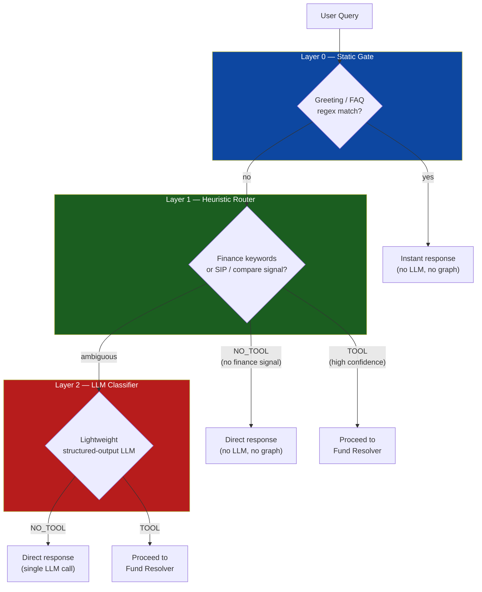
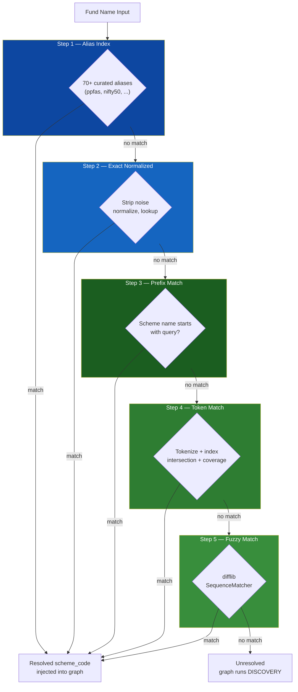
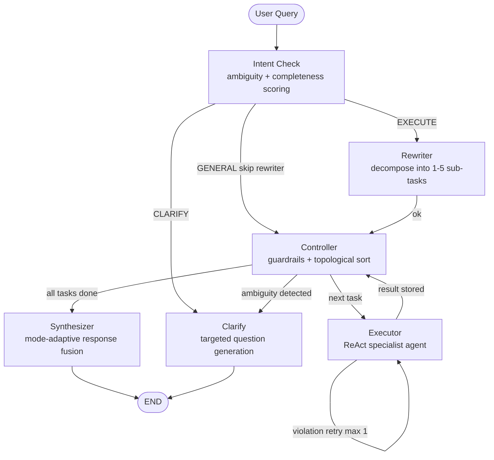
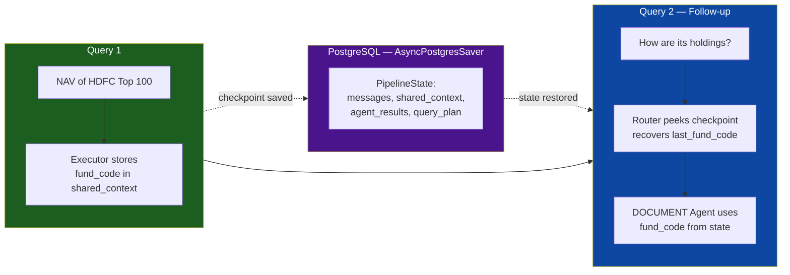
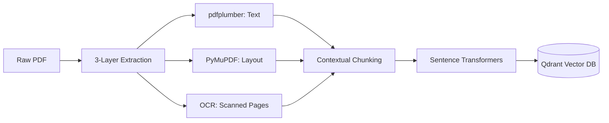

<div align="center">

# 🔍 FinSight: Agentic Financial Research RAG

[](https://github.com/Geeky-Sam01/agentic-research-rag/actions/workflows/ci.yml)
[](https://github.com/Geeky-Sam01/agentic-research-rag/actions)
[](https://fastapi.tiangolo.com/)
[](https://angular.io/)
[](https://langchain.com/)
[](https://qdrant.tech/)

</div>

**FinSight** is an autonomous financial research assistant that combines deep document analysis with live market data retrieval. Built on a two-phase agentic pipeline, it doesn't just find information — it routes, resolves, researches, verifies, and synthesizes analytical answers.

---

## 🌟 Flagship Features

| Feature | Description |
|---|---|
| **🧭 3-Layer Smart Router** | Intercepts simple queries before they touch the graph — static regex, heuristic keywords, and a lightweight LLM classifier work in cascade to minimize latency. |
| **🛡️ Smart Fund Resolver** | A pre-graph semantic entity resolution layer that maps colloquial fund names and historical aliases to exact AMFI scheme codes via a 5-step matching cascade. |
| **🧠 6-Node LangGraph Pipeline** | Intent check → Rewriter → Controller → Executor loop → Synthesizer, with a dedicated Clarify node for ambiguous queries. |
| **📋 Structured Query Planner** | Decomposes complex financial queries into up to 5 typed, dependency-aware sub-tasks before execution. |
| **🔄 Operation-Centric Executor** | ReAct agents scoped to specific operations (nav_lookup, holdings_analysis, sip_projection, etc.) with dependency injection, post-check validation, and auto-retry. |
| **📈 SIP Simulation Engine** | Robust backtesting for historical SIP returns and CAGR-based future projections with yearly top-ups. |
| **📑 3-Layer PDF Engine** | High-fidelity extraction using `pdfplumber`, `PyMuPDF`, and `Tesseract OCR` fallback for scanned financial reports. |
| **📉 Mutual Fund Intelligence** | Live NAV quotes and historical performance tracking with a 5-day automated fallback mechanism. |
| **💾 Multi-Turn Memory** | PostgreSQL-backed checkpointing via LangGraph's `AsyncPostgresSaver` with lightweight checkpoint peeking for fast follow-up routing. |
| **⚡ Real-Time Thought Trace** | Transparent research logs showing tool calls and retrieval steps in a collapsible, persistent UI accordion. |
| **🔗 Deep Source Attribution** | Evidence panel that highlights and previews exact source chunks used in every response. |

---

## 🏗️ System Architecture

Every query is processed through two sequential phases. Most simple queries are resolved in Phase 1 and never reach the graph.

---

### Phase 1 — Pre-Graph Layer

Two lightweight systems run before the LangGraph pipeline is invoked.

#### 🧭 3-Layer Router (`router.py`)

Decides whether the agent graph is needed at all. Layers run in cascade — if any layer produces a high-confidence decision, the remaining layers are skipped entirely.



Queries handled as `NO_TOOL` or `static` never reach the graph, keeping latency low for conversational and conceptual queries.

#### 🛡️ Smart Fund Resolver (`fund_resolver.py`)

When a query needs tool execution, the resolver attempts to map any fund name in the query to an exact 6-digit AMFI scheme code before the graph starts. The resolved code is injected into the initial graph state, preventing redundant DISCOVERY tasks.

Resolution runs as a 5-step cascade, stopping at the first confident match:



---

### Phase 2 — LangGraph Execution (6-Node Graph)

Queries that require live data, calculations, or document analysis run through a compiled LangGraph state machine with 6 nodes.

#### Full Graph Topology



#### Node Responsibilities

**`intent_check`**
Runs before the rewriter on every query. Extracts features (fund entity, category, amount, tenure), detects intent via a hybrid heuristic + LLM classifier, and computes completeness and ambiguity scores. Routes to `EXECUTE`, `GENERAL` (with a pre-built plan, skips rewriter), or `CLARIFY`.

**`rewriter`**
Calls a structured-output LLM planner to decompose the query into up to 5 typed `SubTask` objects. Each task has an intent (`DATA`, `PERFORMANCE`, `DISCOVERY`, `DOCUMENT`, `CALCULATOR`, `GENERAL`), a set of operations, a priority, and a `requires` dependency list. Enforces a hard cap of 5 tasks.

**`controller`**
Validates the task plan and enforces guardrails before execution:
- Prunes redundant `DISCOVERY` tasks if a fund was already pre-resolved
- Injects a forced `DISCOVERY` task if downstream tasks need a scheme code but none is available
- Caps execution at 5 total tasks
- Limits `DOCUMENT` tasks to 1 (expensive RAG operation)
- Runs a topological sort (with cycle detection) to order tasks by dependency, then priority

**`executor`** _(invoked once per task by the controller loop)_
Runs the correct ReAct specialist agent for each task in order. For every task:
1. **Pre-check** — blocks execution if any declared dependency failed
2. **Context injection** — builds a rich message list from shared state, resolved entities, and dependency outputs
3. **Agent execution** — runs the scoped ReAct agent with only the tools relevant to the task's operations
4. **Post-check** — verifies the agent actually used the required scheme code (for DATA/CALCULATOR tasks)
5. **Retry** — re-runs once with a stronger instruction if post-check fails (max 1 retry)

Results are accumulated into `agent_results` and `shared_context` for downstream tasks.

#### Specialist Agents

| Agent | Intent | Tools |
|---|---|---|
| DATA | nav_lookup, fund_info | get_scheme_quote, get_historical_nav, get_scheme_details |
| PERFORMANCE | returns_analysis, benchmark | get_equity_performance, get_debt_performance, get_hybrid_performance |
| DISCOVERY | fund_search | search_schemes, search_scheme_by_name |
| DOCUMENT | holdings, sector_alloc | read_factsheet (Qdrant RAG) |
| CALCULATOR | sip_projection | calculate_returns (NAV simulation) |
| GENERAL | conversational | None |

**`synthesizer`**
Merges all agent results into a single user-facing response. Selects a response mode automatically:
- `concise` — single NAV lookup, returned deterministically (no LLM call)
- `analytical` — multi-fund or performance query, LLM formats a Markdown table with key takeaways
- `detailed` — follow-up queries or complex multi-step results, full LLM synthesis with reasoning

Includes follow-up detection: if the current query is a short follow-up to a prior AI response, the mode upgrades to `detailed` automatically.

**`clarify`**
Generates targeted clarification questions from the `missing_fields` list produced by `intent_check`. Single missing field → one focused question with an example. Multiple missing fields → numbered list capped at 3 questions, with quick-choice options where applicable.

---

### Shared Context Layer

The `shared_context` dict flows through the entire graph and accumulates across executor iterations. It holds:

- `_resolved_fund` — pre-resolved scheme code from the Fund Resolver
- `resolved_schemes` — mapping of all scheme codes resolved during execution (supports multi-fund queries)
- `scheme_code`, `nav`, `fund`, `amc`, `date`, `category` — structured fields extracted from tool outputs
- `_ambiguity_hint` — injected by `intent_check` on GENERAL to guide the rewriter

---

### 💾 Multi-Turn Memory

Every graph invocation is checkpointed to PostgreSQL via `AsyncPostgresSaver`. Each conversation thread maintains a persistent `PipelineState` across turns, preserving messages, shared context, agent results, and the query plan.

On follow-up queries, the pre-graph router performs a lightweight checkpoint peek to recover `last_fund_name` and `last_fund_code` without a full state restore — making follow-up routing both fast and context-aware. The controller then merges the restored state with any new context, so queries like "How are its holdings?" resolve correctly without re-stating the fund name.



---

### 📥 Document Ingestion Pipeline



---

## 🖼️ Gallery

### 🖥️ 2-Pane Dashboard
The intuitive 2-pane interface separates the primary research chat from the context-aware knowledge sidebar.
<p align="center">
  
</p>

### 🧠 Research Steps & 📊 Structured Analysis
Inspect the agent's real-time thought process or switch to "Explainer Mode" for highly structured tabular summaries.
<p align="center">
  
  
</p>

### 📚 Knowledge Library
Command center for document management, indexing status, and automated discovery.
<p align="center">
  
</p>

---

## 🛠️ Tech Stack

### Backend
- **FastAPI** — High-performance async API framework
- **LangGraph & LangChain** — Graph-based agent orchestration with state checkpointing via PostgreSQL
- **Qdrant** — High-performance vector database (local storage mode)
- **Sentence Transformers** — Local embedding generation (`all-MiniLM-L6-v2`)
- **pdfplumber / PyMuPDF / Tesseract** — 3-layer PDF extraction pipeline
- **Langfuse** — Optional observability and tracing

### Frontend
- **Angular 21** — Stateful SPA framework
- **Tailwind CSS v4** — Utility-first styling
- **PrimeNG** — Professional UI component library
- **IndexedDB** — Persistent local storage for chat history

---

## 🚀 Getting Started

### 1. Backend Setup
```bash
cd backend
uv sync
# Create .env with your OpenRouter API Key
python -m uvicorn app.main:app --reload
```

### 2. Frontend Setup
```bash
cd frontend
npm install
npm start
```

---

> [!IMPORTANT]
> **FinSight** is built with a "Privacy First" mindset. All embeddings are generated locally, and your documents are stored in a private local Qdrant instance.
