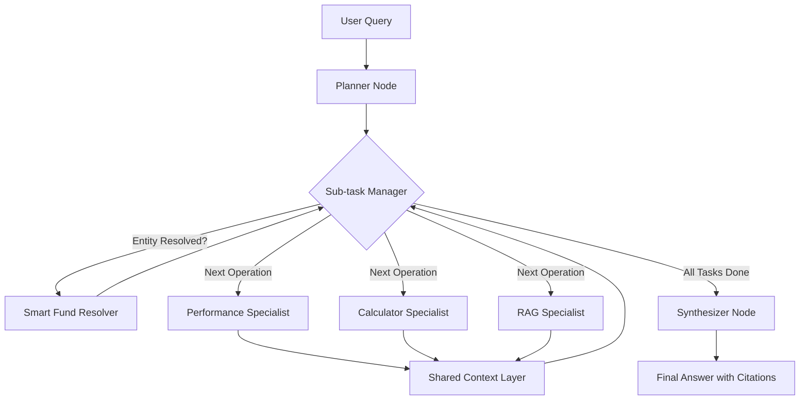
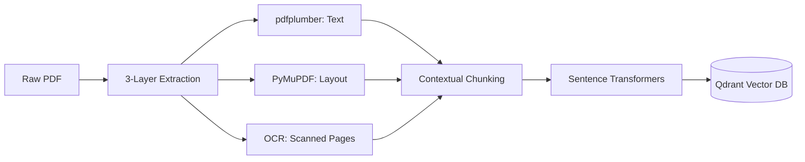

<div align="center">

# 🔍 FinSight: Agentic Financial Research RAG

[](https://github.com/Geeky-Sam01/agentic-research-rag/actions/workflows/ci.yml)
[](https://github.com/Geeky-Sam01/agentic-research-rag/actions)
[](https://fastapi.tiangolo.com/)
[](https://angular.io/)
[](https://langchain.com/)
[](https://qdrant.tech/)

</div>

**FinSight** is an autonomous financial research assistant that combines deep document analysis with live market data retrieval. Built on an agentic RAG pipeline, it doesn't just find information—it researches, verifies, and synthesizes analytical answers.

---

## 🌟 Flagship Features

| **🧠 Multi-Step Planner** | The primary graph gate that decomposes complex financial queries into up to 5 strategic sub-tasks. |
| **🛡️ Smart Fund Resolver** | A semantic entity resolution layer that maps colloquial fund names to exact AMFI codes with 95%+ accuracy. |
| **🔄 Operation-Centric** | Advanced ReAct orchestration that maintains a shared context layer for cross-tool entity resolution. |
| **📈 SIP Simulation Engine** | Robust backtesting tool for historical SIP returns and CAGR-based future projections with yearly top-ups. |
| **📑 3-Layer PDF Engine** | High-fidelity extraction using `pdfplumber`, `PyMuPDF`, and `Tesseract OCR` fallback for scanned financial reports. |
| **📉 Mutual Fund Intelligence** | Live NAV quotes and historical performance tracking with a 5-day automated fallback mechanism. |
| **⚡ Real-Time Thought Trace** | Transparent research logs showing tool calls and retrieval steps in a collapsible, persistent UI accordion. |
| **🔗 Deep Source Attribution** | Instant verification with an evidence panel that highlights and previews the exact source chunks used. |

---

## 📊 System Architecture

### 🔄 Operation-Centric Reasoning Loop
FinSight utilizes a multi-node LangGraph architecture with specialized gates:

1.  **The Planner (Gate 1)**: Rewrites and decomposes the query into a sequence of dependent operations.
2.  **The Executor (Gate 2)**: A dynamic routing loop that selects the best specialist tool (RAG, Performance, or Calculator) based on the current sub-task.
3.  **The Synthesizer (Final Gate)**: Aggregates findings from all operations into a cohesive, evidence-backed response.



### 📥 Optimized Ingestion Pipeline
Ensures maximum context preservation for complex financial layouts.



---

## 🖼️ Gallery

### 🖥️ 2-Pane Dashboard
The intuitive 2-pane interface separates the primary research chat from the context-aware knowledge sidebar.
<p align="center">
  
</p>

### 🧠 Research Steps & 📊 Structured Analysis
Inspect the agent's real-time thought process or switch to "Explainer Mode" for highly structured tabular summaries.
<p align="center">
  
  
</p>

### 📚 Knowledge Library
Command center for document management, indexing status, and automated discovery.
<p align="center">
  
</p>

---

## 🛠️ Tech Stack

### Backend Powerhouse
- **FastAPI**: High-performance asynchronous API framework.
- **LangGraph & LangChain**: Orchestration engine for operation-centric reasoning and multi-step tool execution.
- **Qdrant**: High-performance vector database running in local storage mode.
- **Sentence Transformers**: Local embedding generation (`all-MiniLM-L6-v2`).

### Frontend Experience
- **Angular 21**: Industrial-grade framework for a snappy, stateful SPAs.
- **Tailwind CSS v4**: Modern utility-first styling for a premium aesthetic.
- **PrimeNG**: Professional-grade UI component library.
- **IndexedDB**: Persistent local storage for chat history.

---

## 🚀 Getting Started

### 1. Backend Setup
```bash
cd backend
uv sync
# Create .env with your OpenRouter API Key
python -m uvicorn app.main:app --reload
```

### 2. Frontend Setup
```bash
cd frontend
npm install
npm start
```

---

> [!IMPORTANT]
> **FinSight** is built with a "Privacy First" mindset. All embeddings are generated locally, and your documents are stored in a private local Qdrant instance.
