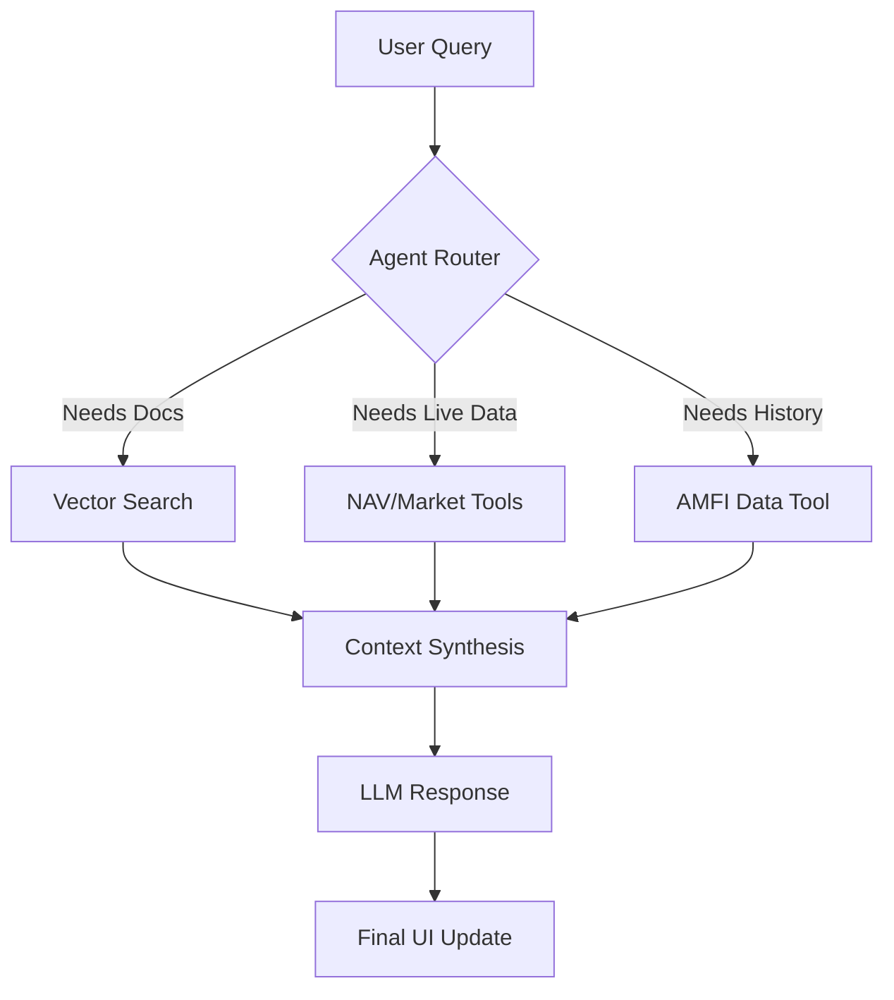
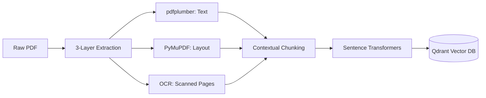

# 🔍 FinSight: Agentic Financial Research RAG

[](https://fastapi.tiangolo.com/)
[](https://angular.io/)
[](https://langchain.com/)
[](https://qdrant.tech/)

**FinSight** is an autonomous financial research assistant that combines deep document analysis with live market data retrieval. Built on an agentic RAG pipeline, it doesn't just find information—it researches, verifies, and synthesizes analytical answers.

---

## 🌟 Flagship Features

| Feature | Description |
| :--- | :--- |
| **🧠 Autonomous Reasoning** | Uses LangGraph ReAct agents to decide between document search, live market data lookups, or historical performance analysis. |
| **📑 3-Layer PDF Engine** | High-fidelity extraction using `pdfplumber`, `PyMuPDF`, and `Tesseract OCR` fallback for scanned financial reports. |
| **📉 Mutual Fund Intelligence** | Dedicated tool registry for live NAV quotes, historical performance tracking, and scheme discovery via AMFI. |
| **⚡ Real-Time Thought Trace** | Transparent research logs showing tool calls and retrieval steps in a collapsible, persistent UI accordion. |
| **🔗 Deep Source Attribution** | Instant verification with an evidence panel that highlights and previews the exact source chunks used. |
| **💾 Multi-Session Memory** | Complete conversation and document state persistence across refreshes using IndexedDB and Qdrant. |

---

## 📊 System Architecture

### 🔄 Agentic Inference Loop
Determines the most accurate path to satisfy a financial query.



### 📥 Optimized Ingestion Pipeline
Ensures maximum context preservation for complex financial layouts.



---

## 🖼️ Gallery

### 🖥️ 2-Pane Dashboard
The intuitive 2-pane interface separates the primary research chat from the context-aware knowledge sidebar.
<p align="center">
  
</p>

### 🧠 Research Steps & 📊 Structured Analysis
Inspect the agent's real-time thought process or switch to "Explainer Mode" for highly structured tabular summaries.
<p align="center">
  
  
</p>

### 📚 Knowledge Library
Command center for document management, indexing status, and automated discovery.
<p align="center">
  
</p>

---

## 🛠️ Tech Stack

### Backend Powerhouse
- **FastAPI**: High-performance asynchronous API framework.
- **LangGraph & LangChain**: Orchestration engine for agentic reasoning and tool binding.
- **Qdrant**: High-performance vector database running in local storage mode.
- **Sentence Transformers**: Local embedding generation (`all-MiniLM-L6-v2`).

### Frontend Experience
- **Angular 21**: Industrial-grade framework for a snappy, stateful SPAs.
- **Tailwind CSS v4**: Modern utility-first styling for a premium aesthetic.
- **PrimeNG**: Professional-grade UI component library.
- **IndexedDB**: Persistent local storage for chat history.

---

## 🚀 Getting Started

### 1. Backend Setup
```bash
cd backend
uv sync
# Create .env with your OpenRouter API Key
python -m uvicorn app.main:app --reload
```

### 2. Frontend Setup
```bash
cd frontend
npm install
npm start
```

---

> [!IMPORTANT]
> **FinSight** is built with a "Privacy First" mindset. All embeddings are generated locally, and your documents are stored in a private local Qdrant instance.